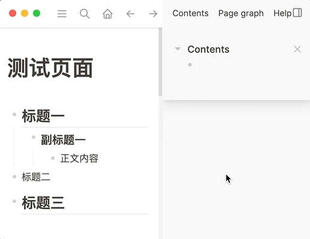

# logseq-plugin-tocgen

在任何地方生成任一页面/块的目录，通过它你可以快速访问页面/块内容。同时提供了滚动回页面顶部的功能。

Generate a TOC of any page/block anywhere and quickly access the page/block's content. A back to top button is also provided.

## 使用展示 (Usage)



## 使用示例 (Examples)

```
为块所在的页面生成TOC。
Generate a TOC for the page where block belongs to.
{{renderer :tocgen}}
{{renderer :tocgen, [[]]}}

为某一页面创建一个TOC，可以用 "[[" 辅助查找想要的页面。
Create a TOC for a page, you can use "[[" to help find the page.
{{renderer :tocgen, pagename}}
{{renderer :tocgen, [[pagename]]}}

你也可以为某一页面块创建一个TOC，直接将块引用粘贴进来就好。
You can also create a TOC for a block, just paste its reference in.
{{renderer :tocgen, ((block-reference))}}

可以指定要生成几级。
You can specify how many levels to generate.
{{renderer :tocgen, [[]], 2}}
{{renderer :tocgen, [[pagename]], 2}}
{{renderer :tocgen, ((block-reference)), 2}}

如果你想在TOC中只包含H1-Hn这种heading，即markdown的`#`至`######`，那么你可以再通过一个参数来指定。
If you want to include only H1-Hn headings, that is, `#` to `######` in markdown,
you need to use a third argument.
{{renderer :tocgen, [[]], 1, h}}
{{renderer :tocgen, [[page name]], 1, h}}
{{renderer :tocgen, ((block-reference)), 1, h}}
```

如果你想生成一个随当前浏览页面变动而变动的 TOC，你可以传`*`作为页面名。

If you want to generate a TOC that dynamically changes according to what page you're currently working on, you can use `*` as page name.

```
{{renderer :tocgen, *}}
{{renderer :tocgen, *, 2}}
{{renderer :tocgen, *, 2, h}}
```

## 用户配置 (User configs)

```json
{
  "disabled": false,
  "defaultLevels": 1,
  "defaultCollaped": false,
  "defaultHeadingType": "any",
  "hideBackTop": false
}
```

在 Logseq 的插件页面打开插件的配置后，有以下几项配置可供使用，请参照上方代码块进行设置（各项的默认值以体现在代码块中）：

- `defaultLevels`: 默认创建目录的级数，创建目录时没有指定级数时会使用此设置。
- `defaultCollapsed`: 默认目录是否为折叠状态。
- `defaultHeadingType`: 默认识别的标题类型。可以指定`any`，代表任何块都可作为标题识别；`h`代表仅 H1-Hn 块可作为标题识别。
- `hideBackTop`: 如果不想要“滚动回页面顶部”这个功能的话可以通过这个设置关闭。

There are a couple of user settings available when you access the plugin settings from Logseq's plugins page. Please refer to the source block above (Default values are given in the source block).

- `defaultLevels`: It defines how many levels a TOC contains by default if not specified when the TOC is created.
- `defaultCollapsed`: It defines whether TOC is collapsed by default.
- `defaultHeadingType`: It defines what kind of blocks can be recognized as a heading. `any` means that any block will do；`h` means that only H1-Hn blocks are accepted as headings.
- `hideBackTop`: You can use this setting to disable the "Back to Top" functionality.

## 自定义样式 (Syle Customization)

你可以通过以下两个 CSS 类来自定义样式，`kef-tocgen-page` 对应页面，`kef-tocgen-block` 对应块。参照 Logseq 自定义样式的文档操作，将内容放在`custom.css`中即可。

You can customize styles using the following two CSS classes, `kef-tocgen-page` for page, `kef-tocgen-block` for block. Refer to Logseq's document for how to customize styles, place your modifications in `custom.css`.

```css
.kef-tocgen-page {
  cursor: pointer;
  line-height: 2;
}
.kef-tocgen-block {
  line-height: 1.7;
}
```

你也可以通过`kef-tocgen-noactivepage`来自定义动态 TOC（见使用示例）的内容与样式。

You can also use `kef-tocgen-noactivepage` to customize dynamic TOC's (see Examples section above) content and style.

```
.kef-tocgen-noactivepage {
  content: "🈚️";
}
```
